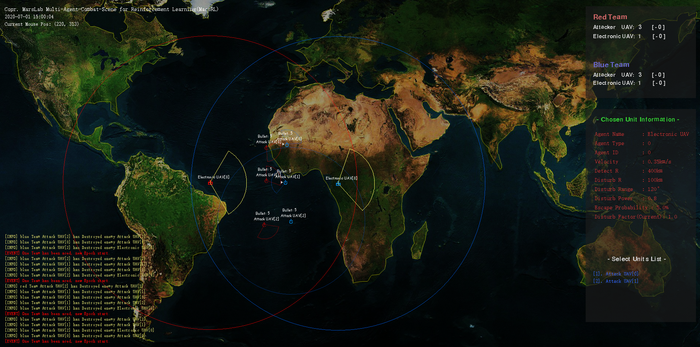
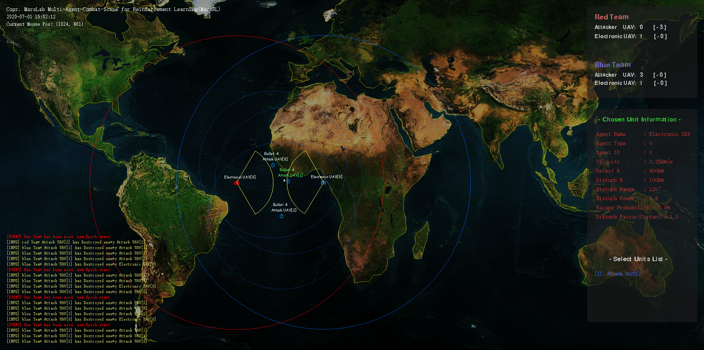
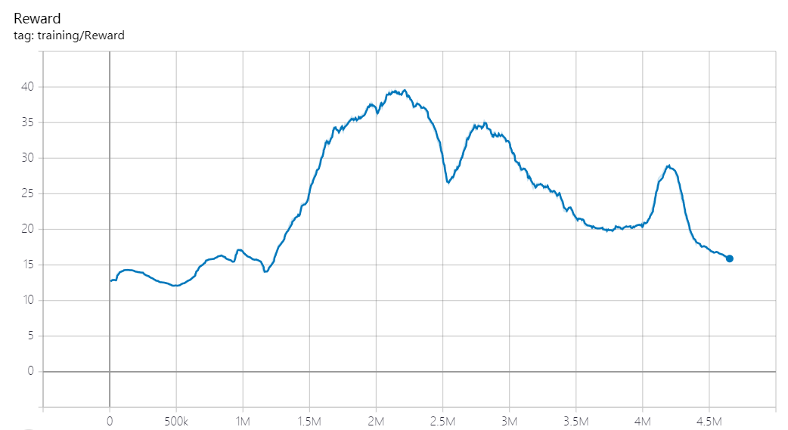
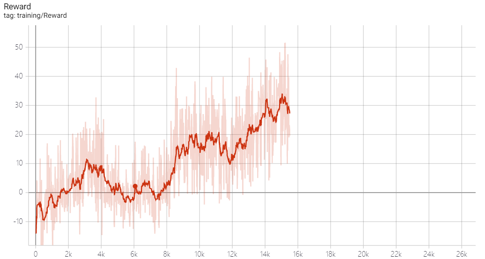
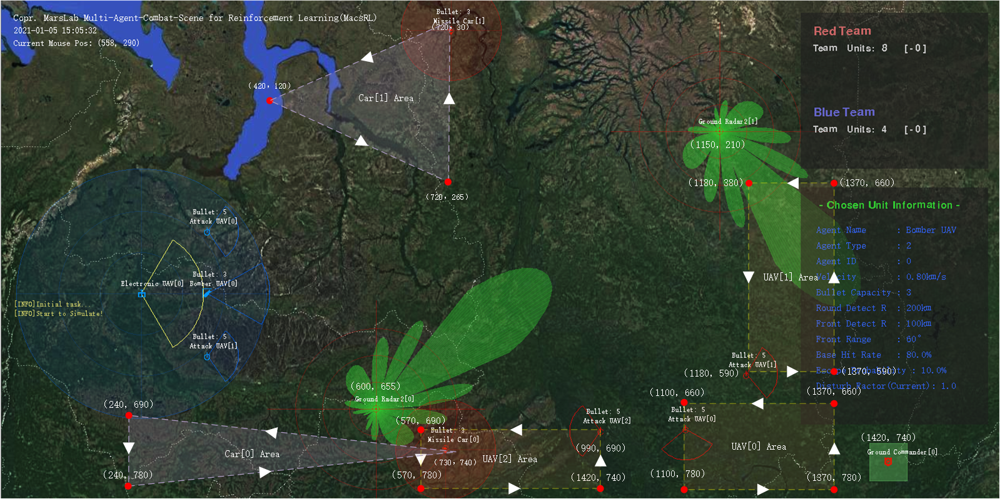
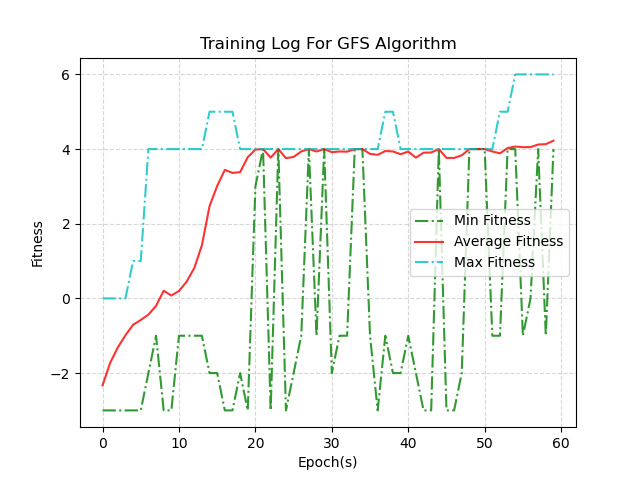
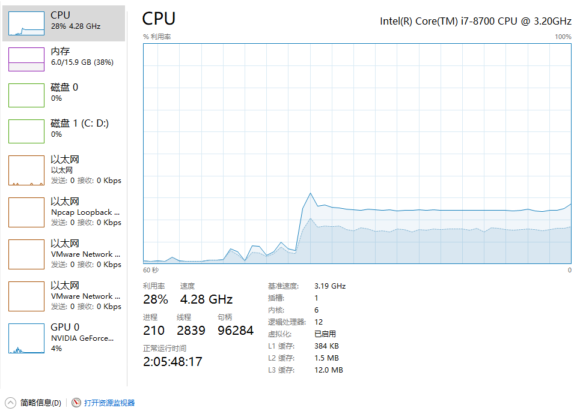
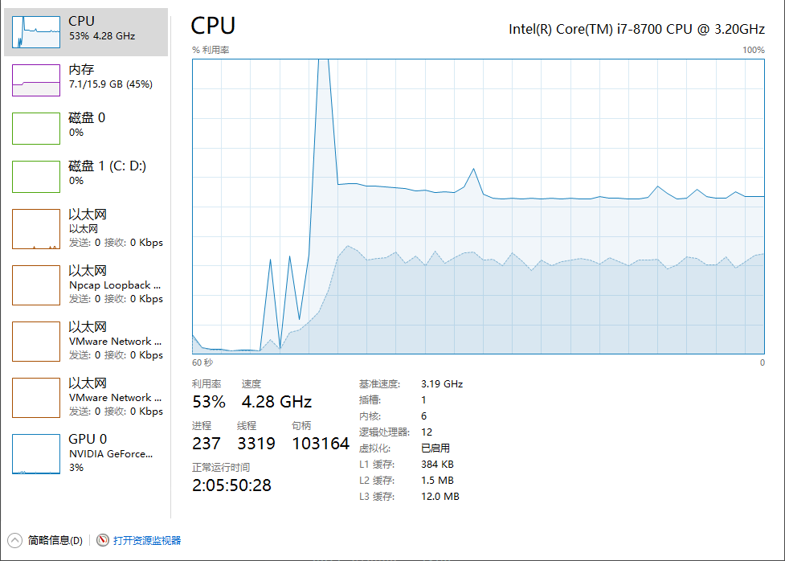
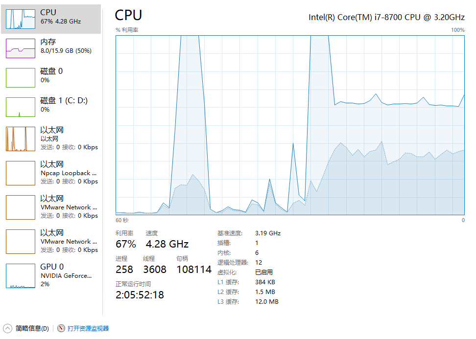

## Multi-Agent Combat Scene for Reinforcement Learning

### 1. MacsRL Brief Introduction

Multi-Agent Combat Scene for Reinforcement Learning(MacsRL) 是一个针对强化学习下多智能体对抗场景设计的仿真训练系统，该系统中包含若干个典型红蓝对抗场景，其问题规模由小到大，求解算法也由易到难。不同场景下，可用作战单位种类会发生变化，其胜利的目标条件也不尽相同，在使用算法进行行为决策的时候应根据不同场景下的取胜目标进行目标函数的设计。MacsRL 会根据具体的场景限制返回每一个作战单元在当下能够获取的观测数据，并根据一些特殊条件的触发来返回 Agent 采取行为后的回报值，在一些稀疏回报的任务中，算法求解者需要根据观测进行 reward shaping，如设计 temp reward 等方法来让算法模型拥有更快的收敛速度。MacsRL 系统中内置 RL 求解算法库，针对每一个场景都会提供一个相对应的解决算法，使用者可以参照这些内置算法进行学习，或是使用您自定义的算法模型完成任务求解。

### 2. Start MacsRL

#### 2.1   4v4 Scene

MacsRL 中包含了若干个对抗场景，这里我们以第一个对抗场景进行入门介绍。入门场景为 “4v4红蓝对抗场景”，该场景中红蓝双方各包含 4 个作战单元，**取胜的任务目标为歼灭敌方全部单位**，对抗场景示意图如下：

<div align=center></div>

4v4 对抗场景中，红蓝双方拥有相同的兵力配置：**电子战飞机x1** + **攻击机x3**，红方为算法求解方，蓝方为 basic-AI 方，使用者需要利用算法模型根据红方单位观测为红方做出行为决策，歼灭蓝方所有作战单位即算任务完成。

* 场景兵种介绍

1. **攻击机（Attack UAV）**

攻击机在整个场景中起到锁定并摧毁敌方作战单元的作用，该单位摧毁能力强，但侦测能力较弱且探测视野范围小，通常与具有较大探测视野的电子战飞机的联合作战。攻击机的雷达拥有两种不同的工作模式：作战模式、侦察模式。通常情况下，攻击机雷达处于侦察模式，侦察模式下攻击机能够探测到周身一定距离内的目标单位；一旦攻击机确定攻击目标并想朝目标发起攻击时，攻击机雷达模式必须切换到作战模式，此时攻击机不能再获取周身目标视野，而是只能获取前向扇形范围内的视野，作战模式下，攻击机会持续锁定扇形范围内的敌方目标，当连续锁定目标一段时间后攻击机会自动发射机载导弹对锁定目标发起进攻。

下图中，蓝方攻击机雷达当前处于探测模式，即攻击机周身会出现蓝色探测圆形范围，此时处于圆形探测范围内的目标能够被攻击机自身所发现，但处于探测模式下的攻击机不具备攻击敌方目标的能力：

<div align=center></div>

下图中的蓝攻击机已经将雷达模式从探测模式切换到了作战模式，即周身蓝色圆形变成了前向扇形范围，攻击机的视野范围也由周身圆环缩减为前向扇形范围。此时的攻击机具备火力打击能力，可以对扇形范围内最近的敌方目标进行锁定并进行火力打击：

<div align=center></div>

<br>

***<u>Observation Space</u>*** 

单个攻击机的观测以一个字典（dict）的形式返回，包含“友方单位观测信息”，“敌方单位观测信息”，“自身相关观测信息”，结构如下所示：

```python
obs = {
    "alliance": [[友方单位1相对坐标, 友方单位1兵种类型, 友方单位1当前朝向], ...],
    "enemy":    [[敌方单位1相对坐标, 敌方单位1兵种类型, 敌方单位1当前朝向], ...],
    "self_info":[剩余弹药量, 当前朝向, 当前绝对坐标，当前是否有已锁定目标]
}
```

其中，

友方观测信息：返回观测视野中所有友方单位观测列表，列表每一项包含该友方单位相对于自身单位的相对坐标、该友方单位的兵种类型（战斗机/电子战飞机）、该友方单位的当前朝向。

敌方观测信息：返回观测视野中敌方单位的观测列表，列表中每一项包含该敌方单位相对于自身单位的相对坐标、该敌方单位的兵种类型（战斗机/电子战飞机）、该敌方单位的当前朝向。

自身相关观测信息：返回自身相关信息列表，列表中包含当前剩余弹药量（初始载弹为5枚）、当前朝向、当前绝对坐标，当前是否有已锁定目标（bool）。由于攻击机并非开启作战雷达后立刻就能攻击视野范围内的目标，而是需要持续锁定一段时间后才能发射，因此最后一个观测信息返回了自己目前是否处于锁定目标状态（True/False ）。

**<u>*Action Space*</u>**

攻击机总共存在 3 个可控行为：机动行为、更改雷达工作模式、是否开启火控锁定。

```python
action_space = [机动指令索引, 雷达工作模式索引, 火控锁定开启标志]
```

其中，

机动指令索引：攻击机在一个step下共存在 3 个机动行为，左转弯，直行，右转弯，其索引分别为：0，1，2。

雷达工作模式：对应攻击机的两种工作模式，侦察模式（0）和作战模式（1）。

火控锁定开启标志：是否对作战范围内最近的敌方目标开启火控锁定，开启（1）和放弃（0）。

2. **电子战飞机（Electronic UAV）**

电子战飞机在对抗场景中起到掩护友方和探测视野的作用。由于攻击机的探测视野范围小，需要队友为其提供敌方位置信息，电子战飞机具有较大的探测范围，可通过信息共享的方式将敌方目标的信息传递给攻击机，起到 “队伍之眼” 的作用。此外，电子战飞机能够有效的掩护我方的单位，电子战飞机能够对自身前方扇形范围区域进行电磁信号掩护，身处该掩护区域的友方单位能够更容易躲避掉来自敌方单位的攻击，即敌方对掩护区域内的我方目标具有更低的命中率。电子战飞机通常处于作战机群的后方，为攻击机提供视野的同时尽可能多的让自身掩护区域覆盖更多的友方单位。

当友方单位出现在电子战飞机的黄色扇形保护区域内时，友方单位名称会变成绿色，此时被保护的友方单位拥有更高的闪避率，敌方对我方单位的攻击命中率会降低：

<div align=center></div>

<br>

***<u>Observation Space</u>*** 

单个电子战飞机的观测以一个字典（dict）的形式返回，包含“友方单位观测信息”，“敌方单位观测信息”，“自身相关观测信息”，结构如下所示：

```python
obs = {
    "alliance": [[友方单位1相对坐标, 友方单位1兵种类型, 友方单位1当前朝向], ...],
    "enemy":    [[敌方单位1相对坐标, 敌方单位1兵种类型, 敌方单位1当前朝向], ...],
    "self_info":[当前朝向，当前绝对坐标]
}
```

其中，

友方观测信息：返回观测视野中所有友方单位观测列表，列表每一项包含该友方单位相对于自身单位的相对坐标、该友方单位的兵种类型（战斗机/电子战飞机）、该友方单位的当前朝向。

敌方观测信息：返回观测视野中敌方单位的观测列表，列表中每一项包含该敌方单位相对于自身单位的相对坐标、该敌方单位的兵种类型（战斗机/电子战飞机）、该敌方单位的当前朝向。

自身相关观测信息：当前自身朝向，当前绝对坐标。

**<u>*Action Space*</u>**

电子战飞机总共存在 1 个可控行为：机动行为。

```python
action_space = [机动指令索引]
```

其中，

机动指令索引：攻击机在一个step下共存在 3 个机动行为，左转弯，直行，右转弯，其索引分别为：0，1，2。

#### 2.2   Reward 

在4v4场景下，环境所反馈的reward是一个队伍的整体reward，即队伍成功击落一个敌方单位获得 +10 的正向 reward，队伍损失一个己方单位得到 -10 的负向 reward。

<br>

### 3.  Win in 4v4 Scene

我们尝试在 4v4 对抗场景下使用多种 Multi-Agent 算法进行模型训练，试验是否能够在该场景下获取胜利。

#### 3.1 COMA (Counterfactual Multi-Agent Policy Gradients)

首先，我们选择使用COMA算法尝试进行问题求解。COMA是一种多智能体下的行为决策算法，其通过独立回报分配（Individual Reward Assign）来让各个智能体单位之间学会共同完成一个目标任务。为了简化实验，我们将红方电子战飞机设置为原地驻留，只起到为战斗机提供视野的功能，不参与任务作战。

1. 在训练初期，红方（训练方）会被蓝方（对手方）很快找到并消灭，如下图所示：

<div align=center></div>

2. 之后的一段时间里，红方利用自身获得的环境返回数据进行自我进化，在第300个Epoch时学习到了出乎我们意料之外的结果：蓝方内置AI在采取作战行为的时候存在一个bug——当红方单位在以一定距离和一定角度处于蓝方前方时，蓝方单位的行为决策器会让蓝方单位在原地做盘旋，COMA算法在训练过程中找到了蓝方行为决策器的这一bug，通过不断调整自身位置使得蓝方单位一直在原地盘旋，以保证己方单位不再被蓝方歼灭：

<div align=center></div>

<br>

#### 3.2 MADDPG (Multi-Agent Deep Deterministic Policy Gradients)

MADDPG 作为 Multi-Agent 的一种求解算法，在 Multi Particle Env 上取得了不错的效果，我们尝试将 MADDPG 应用到 MacsRL 中 4v4 场景下，为了简化实验，我们将红方电子战飞机设置为原地驻留，只起到为战斗机提供视野的功能，不参与任务作战。

1. **定点歼灭任务**

为了验证 MADDPG 是否适用于该环境，训练初期采用 “定点歼灭” 任务进行模型训练，即蓝方所有单位都在原地盘旋，红方单位需要学会找到蓝方单位并发起进攻。为了减小无意义的大规模探索，算法训练过程中使用奖励引导机制使得我方战斗机能够被敌方作战单位“吸引”，从而完成探寻-歼灭任务。

<div align=center></div>

训练过程中 reward 曲线如上图所示，当训练到 1.5M 个 steps 时红方能够成功摧毁敌方 1 个目标单位，如下图所示，最下方的蓝色目标被我方红方战斗机击毁：

<div align=center></div>

当训练到 2.25M 个 steps 时，我方单位能成功摧毁敌方 2 个目标单位，如下所示：

<div align=center></div>

从上面两个实验可以看出，针对定点盘旋的蓝方队伍，MADDPG 能够成功控制我方目标进行目标歼灭任务。

2. **歼灭 Rule-Based 蓝方任务**

进一步的，我们将蓝方队伍调整为基于基本规则的作战规则，并使用 MADDPG 进行训练。蓝方采用 $\epsilon-attack$ 的作战模式，即按照一定概率对红方发起进攻，一定概率不发起进攻，$\epsilon$ 的设置直接决定了蓝方的强弱，当选择较高 $\epsilon$ 时，蓝方会变得非常强大，导致红方几乎无法战胜蓝方。下图为 $\epsilon=1$ 时的训练效果，MADDPG 最终学习出在看到蓝方敌机时会掉头逃跑从而避免阵亡：

<div align=center></div>

<br>

#### 3.3 QMIX

QMix 是近年来新推出的一套 Multi-Agent 算法，同 COMA 算法一样，QMix 解决的也是如何为每一个智能体进行独立回报分配的问题。我们在 4v4 场景下尝试使用 QMix 算法进行求解，为了简化实验，我们将红方电子战飞机设置为原地驻留，只起到为战斗机提供视野的功能，不参与任务作战，整个过程中训练曲线如下图所示：

<div align=center></div>

1. **学会绕后攻击的作战策略**

下图是 QMix 算法在训练阶段学习到的“绕后攻击”策略，注意图中中间红方攻击机（id：2）首先避开了正面迎面而来的蓝方敌机，在离开敌机的攻击范围后选择回头绕飞到敌机身后并将其击落：

<div align=center></div>

2. **具备找到蓝方敌机并击毁的能力**

下图是19400个回合后模型表现出的能力，可以看出此时红方能够找到地图中飞行的蓝方敌机并将其击落：

<div align=center></div>


### 4.  Others Scene in  MacsRL

#### 4.1 Break In Scene  (Combat with StateMachine)

##### 4.1.1 Introduction

此场景是突防场景下的第二个任务场景，任务目标与上一个突防场景相同，蓝方队伍需要突破红方队伍的防守线并摧毁红方地面指挥部，但不同的是，该场景下红方采用**状态机**（State Machine）建立防守体系。相较于前一个场景中的 $\epsilon-attack$ 算法，状态机拥有更加灵活且更加智能的防守决策能力，蓝方需要从红方的防御体系中找到相应的对策并完成突防任务。

突防场景示意图如下所示：

<div align=center></div>

> 红方（防守方）

红方作为防守方，一共包含3种作战单位：地面侦测雷达（GroundRadar）、攻击机（AttackUAV）和地面防空车（Missile Car）。

1. **地面侦测雷达（GroundRadar）**

地面侦测雷达采用波束扫描雷达模型，雷达共存在两种工作模式：搜索模式（Search Mode）和追踪模式（Tracking Mode）。状态机算法模型会根据雷达当前的观测自动调整雷达的工作模式：

* 搜索模式（Search Mode）：在未发现敌方威胁目标的情况下，雷达会按照预设角速度进行匀速区域扫描。
* 追踪模式（Tracking Mode）：在发现入侵目标后，雷达会退出搜索模式进入追踪模式。雷达会持续追踪该入侵目标并通知己方防守单位对该目标进行打击，直到敌方目标被击毁或离开追踪范围，目标消失后雷达会退出追踪模式转化成搜索模式。

雷达从搜索模式切换到追踪模式如下所示：

<iframe src="//player.bilibili.com/player.html?aid=801085515&bvid=BV1Yy4y1v7T4&cid=281146434&page=1" scrolling="no" border="0" frameborder="no" framespacing="0" allowfullscreen="true"> </iframe>

***<u>Observation Space</u>*** 

观测以一个字典（dict）的形式返回，包含“友方单位观测信息”，“敌方单位观测信息”，“自身相关观测信息”，结构如下所示：

```python
obs = {
    "alliance": [[友方单位1相对坐标, 友方单位1兵种类型, 友方单位1当前朝向], ...],
    "enemy":    [[敌方单位1相对坐标, 敌方单位1兵种类型, 敌方单位1当前朝向], ...],
    "self_info":[当前朝向, 当前绝对坐标]
}
```

其中，

友方观测信息：返回观测视野中所有友方单位观测列表，列表每一项包含该友方单位相对于自身单位的相对坐标、该友方单位的兵种类型（战斗机/电子战飞机）、该友方单位的当前朝向。

敌方观测信息：返回观测视野中敌方单位的观测列表，列表中每一项包含该敌方单位相对于自身单位的相对坐标、该敌方单位的兵种类型（战斗机/电子战飞机）、该敌方单位的当前朝向。

自身相关观测信息：当前绝对坐标

**<u>*Action Space*</u>**

```python
action_space = [旋转机动索引, 切换载波频率索引]
```

其中，

旋转索引：雷达在一个step下共存在2个机动行为，顺时针角速度旋转$\omega$°、逆时针角速度旋转$\omega$°，其索引分别为：0，1。

切换载波频率索引：侦测雷达存在若干种载波信号，可以通过频率索引来切换使用哪一种频率的信号，索引取值范围应在0 ~ len(lambdaList) – 1之间。

<br>

2. **攻击机（AttackUAV）**

攻击机在任务中起到打击敌方入侵目标的任务，在整个防御过程中，攻击机存在两种工作模式：巡航模式（Patrol Mode）和打击模式（Assault Mode）。状态机算法会根据当前观测自动调整攻击机的工作模式：

* 巡航模式（Patrol Mode）：在未发现敌方入侵目标前，按照预设巡航路线进行飞行巡航。
* 打击模式（Assault Mode）：在发现了敌方入侵目标后，会立即退出巡航模式并对入侵目标发起进攻。若观测中存在多个敌方目标，攻击机会自主判断并选择一个目标作为攻击目标。当入侵目标全部被消灭或丢失目标信息，攻击机会退出打击模式并转入巡航模式。

在第一节示意图中，黄色虚线即为攻击机的预设巡航路线。

***<u>Observation Space</u>*** 

单个攻击机的观测以一个字典（dict）的形式返回，包含“友方单位观测信息”，“敌方单位观测信息”，“自身相关观测信息”，结构如下所示：

```python
obs = {
    "alliance": [[友方单位1相对坐标, 友方单位1兵种类型, 友方单位1当前朝向], ...],
    "enemy":    [[敌方单位1相对坐标, 敌方单位1兵种类型, 敌方单位1当前朝向], ...],
    "self_info":[剩余弹药量, 当前朝向, 当前绝对坐标，当前是否有已锁定目标]
}
```

其中，

友方观测信息：返回观测视野中所有友方单位观测列表，列表每一项包含该友方单位相对于自身单位的相对坐标、该友方单位的兵种类型（战斗机/电子战飞机）、该友方单位的当前朝向。

敌方观测信息：返回观测视野中敌方单位的观测列表，列表中每一项包含该敌方单位相对于自身单位的相对坐标、该敌方单位的兵种类型（战斗机/电子战飞机）、该敌方单位的当前朝向。

自身相关观测信息：返回自身相关信息列表，列表中包含当前剩余弹药量（初始载弹为5枚）、当前朝向、当前绝对坐标，当前是否有已锁定目标（bool）。由于攻击机并非开启作战雷达后立刻就能攻击视野范围内的目标，而是需要持续锁定一段时间后才能发射，因此最后一个观测信息返回了自己目前是否处于锁定目标状态（True/False ）。

**<u>*Action Space*</u>**

攻击机总共存在 3 个可控行为：机动行为、更改雷达工作模式、是否开启火控锁定。

```python
action_space = [机动指令索引, 雷达工作模式索引, 火控锁定开启标志]
```

其中，

机动指令索引：攻击机在一个step下共存在 3 个机动行为，左转弯，直行，右转弯，其索引分别为：0，1，2。

雷达工作模式：对应攻击机的两种工作模式，侦察模式（0）和作战模式（1）。

火控锁定开启标志：是否对作战范围内最近的敌方目标开启火控锁定，开启（1）和放弃（0）。

<br>

3. **防空车（Missile Car）**

防空车在任务中起到打击敌方入侵目标的任务，在整个防御过程中，防空车同样存在两种工作模式：巡航模式（Patrol Mode）和打击模式（Assault Mode）。状态机算法会根据当前观测自动调整防空车的工作模式：

* 巡航模式（Patrol Mode）：在未发现敌方入侵目标前，按照预设巡航路线进行路面巡航。
* 打击模式（Assault Mode）：在发现了敌方入侵目标后，会立即退出巡航模式并对入侵目标发起进攻。若观测中存在多个敌方目标，防空车会自主判断并选择一个目标作为攻击目标。当入侵目标全部被消灭或丢失目标信息，防空车会退出打击模式并转入巡航模式。

在示意图中，紫色虚线即为防空车的预设巡航路线。

***<u>Observation Space</u>*** 

单个防空车的观测以一个字典（dict）的形式返回，包含“友方单位观测信息”，“敌方单位观测信息”，“自身相关观测信息”，结构如下所示：

```python
obs = {
    "alliance": [[友方单位1相对坐标, 友方单位1兵种类型, 友方单位1当前朝向], ...],
    "enemy":    [[敌方单位1相对坐标, 敌方单位1兵种类型, 敌方单位1当前朝向], ...],
    "self_info":[剩余弹药量, 当前朝向, 当前绝对坐标，当前是否有已锁定目标]
}
```

其中，

友方观测信息：返回观测视野中所有友方单位观测列表，列表每一项包含该友方单位相对于自身单位的相对坐标、该友方单位的兵种类型（战斗机/电子战飞机）、该友方单位的当前朝向。

敌方观测信息：返回观测视野中敌方单位的观测列表，列表中每一项包含该敌方单位相对于自身单位的相对坐标、该敌方单位的兵种类型（战斗机/电子战飞机）、该敌方单位的当前朝向。

自身相关观测信息：剩余弹药量, 当前朝向, 当前绝对坐标，当前是否有已锁定目标。

**<u>*Action Space*</u>**

防空车总共存在 3 个可控行为：机动行为、更改雷达工作模式、是否开启火控锁定。

```python
action_space = [机动指令索引, 雷达工作模式索引, 火控锁定开启标志]
```

其中，

机动指令索引：攻击机在一个step下共存在 3 个机动行为，左转弯，直行，右转弯，其索引分别为：0，1，2。

雷达工作模式：对应攻击机的两种工作模式，侦察模式（0）和作战模式（1）。

火控锁定开启标志：是否对作战范围内最近的敌方目标开启火控锁定，开启（1）和放弃（0）。

<br>

> 蓝方（突防方）

蓝方拥有三种突防兵力：**攻击机x2**、**轰炸机x1** 和 **电子战飞机x1**，三种空中力量需要相互配合，完成红方地面目标的摧毁。


1. **攻击机（Attack UAV）**

攻击机在整个场景中起到锁定并摧毁敌方作战单元的作用，该单位摧毁能力强，但侦测能力较弱且探测视野范围小，通常与具有较大探测视野的电子战飞机的联合作战。攻击机的雷达拥有两种不同的工作模式：作战模式、侦察模式。通常情况下，攻击机雷达处于侦察模式，侦察模式下攻击机能够探测到周身一定距离内的目标单位；一旦攻击机确定攻击目标并想朝目标发起攻击时，攻击机雷达模式必须切换到作战模式，此时攻击机不能再获取周身目标视野，而是只能获取前向扇形范围内的视野，作战模式下，攻击机会持续锁定扇形范围内的敌方目标，当连续锁定目标一段时间后攻击机会自动发射机载导弹对锁定目标发起进攻。

***<u>Observation Space</u>*** 

单个攻击机的观测以一个字典（dict）的形式返回，包含“友方单位观测信息”，“敌方单位观测信息”，“自身相关观测信息”，结构如下所示：

```python
obs = {
    "alliance": [[友方单位1相对坐标, 友方单位1兵种类型, 友方单位1当前朝向], ...],
    "enemy":    [[敌方单位1相对坐标, 敌方单位1兵种类型, 敌方单位1当前朝向], ...],
    "self_info":[剩余弹药量, 当前朝向, 当前绝对坐标，当前是否有已锁定目标]
}
```

**<u>*Action Space*</u>**

攻击机总共存在 3 个可控行为：机动行为、更改雷达工作模式、是否开启火控锁定。

```python
action_space = [机动指令索引, 雷达工作模式索引, 火控锁定开启标志]
```

<br>

2. **电子战飞机（Electronic UAV）**

电子战飞机在对抗场景中起到掩护友方和探测视野的作用。由于攻击机的探测视野范围小，需要队友为其提供敌方位置信息，电子战飞机具有较大的探测范围，可通过信息共享的方式将敌方目标的信息传递给攻击机，起到 “队伍之眼” 的作用。此外，电子战飞机能够有效的掩护我方的单位，电子战飞机能够对自身前方扇形范围区域进行电磁信号掩护，身处该掩护区域的友方单位能够更容易躲避掉来自敌方单位的攻击，即敌方对掩护区域内的我方目标具有更低的命中率。电子战飞机通常处于作战机群的后方，为攻击机提供视野的同时尽可能多的让自身掩护区域覆盖更多的友方单位。

***<u>Observation Space</u>*** 

单个电子战飞机的观测以一个字典（dict）的形式返回，包含“友方单位观测信息”，“敌方单位观测信息”，“自身相关观测信息”，结构如下所示：

```python
obs = {
    "alliance": [[友方单位1相对坐标, 友方单位1兵种类型, 友方单位1当前朝向], ...],
    "enemy":    [[敌方单位1相对坐标, 敌方单位1兵种类型, 敌方单位1当前朝向], ...],
    "self_info":[当前朝向，当前绝对坐标]
}
```

**<u>*Action Space*</u>**

电子战飞机总共存在 2 个可控行为：机动行为，是否开启干扰雷达。

```python
action_space = [机动指令索引, 是否开启干扰雷达]
```

<br>

3. **轰炸机（Bomer UAV）**

轰炸机只能针对**地面单位**进行攻击，其拥有更窄的探测角度与更长的攻击距离。轰炸机用于攻击敌方的地面单位，例如地面侦测雷达、防空小车等等，利用轰炸机来摧毁地面防御单位能够使得己方空中单位不被摧毁。

***<u>Observation Space</u>*** 

单个轰炸机的观测以一个字典（dict）的形式返回，包含“友方单位观测信息”，“敌方单位观测信息”，“自身相关观测信息”，结构如下所示：

```python
obs = {
    "alliance": [[友方单位1相对坐标, 友方单位1兵种类型, 友方单位1当前朝向], ...],
    "enemy":    [[敌方单位1相对坐标, 敌方单位1兵种类型, 敌方单位1当前朝向], ...],
    "self_info":[剩余弹药量, 当前朝向, 当前绝对坐标，当前是否有已锁定目标]
}
```

**<u>*Action Space*</u>**

轰炸机总共存在 3 个可控行为：机动行为、更改雷达工作模式、是否开启火控锁定。

```python
action_space = [机动指令索引, 雷达工作模式索引, 火控锁定开启标志]
```

<br>

##### 4.1.2 Reward

该场景下每一个不同的目标单位都具有不同的价值奖励，当摧毁敌方/己方被摧毁对应的单位会按照奖励列表增加/扣除相应的奖励得分值。奖励价值表可在 Simulator/Scene/RewardDict.py 下查看，具体价值如下：

```python
""" 回报函数字典，不同type的Agent价值得分 """
RewardDict = {
    0: 1.0,      # 电子战飞机
    1: 1.0,      # 战斗机
    2: 1.0,      # 轰炸机
    3: 1.5,      # 防空车
    4: 2.0,      # 地面探测雷达
    5: 5.0       # 指挥部
}
```

<br>

##### 4.1.3 Use Algorithm to beat Red Bulit-in AI

使用 GFS 算法对突防方（蓝方）进行训练，对蓝方 4 个单位：2 架攻击机、1 架轰炸机和 1 架电子战飞机进行控制，其中，攻击机和轰炸机使用两个独立的 GFS 模型分别控制，电子战飞机采用 Simple Follow Rule 模型进行控制。为了解决原始场景下 Sparse Reward 的问题，在训练过程中为每一个 Agent 设立了 Temp Target，以引导智能体一步一步完成突防目标，训练曲线如下所示：

<div align=center></div>

* 第一阶段：学会通过敌方雷达诱敌并击毁敌方防空小车

由于防守方（红方）采用的策略为，当雷达探测到敌方目标后会启用跟踪模式（Track Mode），雷达将持续锁定该目标并通知其他防守单位（防空车，巡航飞机等）前来摧毁该入侵目标，通过第一阶段的训练和学习，突防方（蓝方）学会主动进入敌方雷达的探测范围，故意暴露自身位置给防守方（红方），诱使红方位于地图上方的防空车前来拦截蓝方的轰炸机，进而摧毁掉敌方防空车。

<iframe src="//player.bilibili.com/player.html?aid=203512344&bvid=BV19h41117XB&cid=281148738&page=1" scrolling="no" border="0" frameborder="no" framespacing="0" allowfullscreen="true"> </iframe>

* 第二阶段：学会优先击毁敌方地面侦测雷达

由于防守方（红方）的探测视野大部分来自于雷达扫描，因此，突防方（蓝方）学会通过配合优先击毁防守方的地面雷达，通过配合进攻的方式，派遣攻击飞机作为诱饵持续吸引敌方雷达的追踪，轰炸机从侧面摧毁掉敌方的地面侦测雷达，从而使防守方（红方）丢失探测视野。

<iframe src="//player.bilibili.com/player.html?aid=458527452&bvid=BV155411n7SU&cid=281148492&page=1" scrolling="no" border="0" frameborder="no" framespacing="0" allowfullscreen="true"> </iframe>

* 第三阶段：学会通过吸引敌方目标，偷袭敌方基地

在整个对抗场景中，敌方基地具有最高的价值，因此，摧毁敌方基地能够获得最大的效用值。第三个阶段的算法模型同样使用了第二阶段当中的 “吸引注意力” 的行为策略，但轰炸机的行为不再是摧毁地面侦测雷达，而是摧毁目标价值更高的敌方基地。

<iframe src="//player.bilibili.com/player.html?aid=628592627&bvid=BV1Dt4y1r7HQ&cid=281148966&page=1" scrolling="no" border="0" frameborder="no" framespacing="0" allowfullscreen="true"> </iframe>

<br>

### 5.  Multi-Env Utils based on Multiprocessing

在训练时，为了加大CPU的利用效率，我们在训练系统中实现了基于 Multiprocessing 的场景多开工具，可以同时并行建立多个仿真环境进行推演计算，提高数据的采样效率。

#### 5.1 MultiEnvController

MultiEnvController 是基于 Multiprocessing（多进程）技术实现的场景多开器，在 Simulator.MultiEnvController 中可以看到该控制器的具体实现代码。下面代码是实例化一个MultiEnvController的过程：

```python
from Simulator.MultiEnvController import make_multiple_envs

""" 实例化多平行环境控制器 """
config_name, env_num = "Scene/4v4_scene.json", 5
multi_env_controller = make_multiple_envs(config_name=config_name, env_num=env_num)

while True:
    obs = multi_env_controller.local_get_observation(["team1", "team2"])

    """
    此时的 obs 变量长度为 env_num 的长度。例如，当 env_num=3 时，obs 的 shape 为 3：
        -> obs[0]: 0号平行环境当前的观测 - [[team1_obs], [team2_obs]]
        -> obs[1]: 1号平行环境当前的观测 - [[team1_obs], [team2_obs]]
        -> obs[2]: 2号平行环境当前的观测 - [[team1_obs], [team2_obs]]
    """
    
    commands = []
    for _ in range(env_num):
        command = [
            # 红方的决策列表
            {
                0: [[1]],
                1: [[random.randint(0, 2), 1, 1], [random.randint(0, 2), 1, 1], [random.randint(0, 2), 1, 1]]
            },
            # 蓝方决策列表
            {
                0: [[1]],
                1: [[random.randint(0, 2), 1, 1], [random.randint(0, 2), 1, 1], [random.randint(0, 2), 1, 1]]
            }
        ]
        commands.append(command)    # commands 是所有并行场景的指令合集

        reward_dicts, dones = multi_env_controller.local_step(commands)
```

其中，

config_name 为子场景 config 文件的名字，env_num 为需要同时开启的并行环境数量。当使用了 multi_env_controller 之后，get_observation() 和 step() 函数都将成为对所有并行场景进行操作，即获取到的 get_observation() 的返回值是一个长度为  env_num  的列表，列表中每一个元素代表一个并行场景下的观测值；同样，在做 step() 命令的时候需要生成长度为 env_num 的 commands 列表，用于对应每一个子场景的决策命令。

下面是分别同时开启 3、30、50 个并行环境时CPU的利用率：

<div align=center></div>

<div align=center></div>

<div align=center></div>

可以看到，随着并行环境数量的上升，CPU的利用率也逐渐上升，可见在进行训练的过程中引入多场景并行交互的方式能够更快的完成数据的采集，从而加快模型的收敛速度。